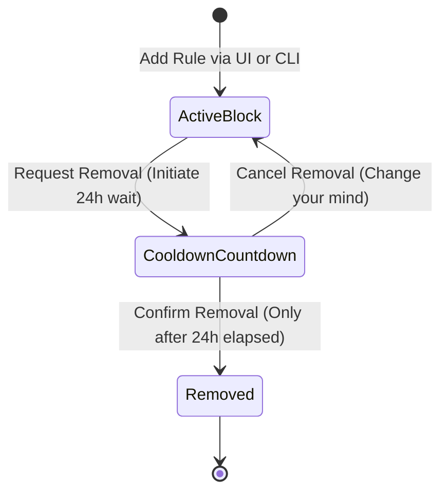

# How FocusWall Works — System Lifecycle & Operational Guide

This document explains how FocusWall functions in your daily workflow, how background enforcement operates autonomously, and why you do not need to keep the UI open.

---

## 1. Autonomous Background Operation

```
  ┌────────────────────────────────────────────────────────┐
  │                   Your Daily Laptop Use                │
  └───────────────────────────┬────────────────────────────┘
                              │
               ┌──────────────┴──────────────┐
               │                             │
               ▼                             ▼
 ┌───────────────────────────┐ ┌───────────────────────────┐
 │   Background Daemon       │ │   Desktop UI              │
 │   (`focuswalld`)          │ │   (`focuswall-ui`)        │
 │                           │ │                           │
 │ • Runs as systemd service │ │ • Unprivileged user app   │
 │ • Starts on laptop boot   │ │ • OPEN ONLY WHEN NEEDED   │
 │ • Continuous kernel guard │ │ • Safe to close anytime   │
 │ • Auto 20:00-21:00 unlock │ │ • Zero impact on blocks   │
 └─────────────┬─────────────┘ └───────────────────────────┘
               │
               ▼
 ┌─────────────────────────────────────────────────────────┐
 │                Linux Kernel & Local DNS                 │
 │ • /etc/dnsmasq.d/focuswall.conf (DNS sinkhole)          │
 │ • nftables table inet focuswall (IP block & DoH guard)  │
 └─────────────────────────────────────────────────────────┘
```

### Key Principles:
1. **You do NOT need to keep the FocusWall UI open.**
   - The UI is strictly a management dashboard.
   - You only need to open the UI when you want to **add a new blocked website**, **check remaining cooldown timers**, or **view audit logs**.
   - After adding a site or checking your status, you can close the window (`Alt+F4`, `Ctrl+Q`, or closing the app). Protection remains 100% active.

2. **The Background Service Runs Silently:**
   - The background daemon (`focuswalld`) runs via `systemd` in the background.
   - It starts automatically when your laptop boots.
   - It consumes virtually zero CPU while idle and wakes up periodically to reconcile schedule windows.

3. **Fail-Closed Kernel & DNS Persistence:**
   - Once DNS rules are written into `/etc/dnsmasq.d/focuswall.conf` and `nftables` tables are loaded in the Linux kernel, they stay active in the system.
   - Even if the UI is closed or the daemon is restarting, the network layer continues to sinkhole and drop blocked traffic.

---

## 2. Daily 1-Hour Quota Automation (YouTube Flexible Sessions)

FocusWall manages YouTube with a **Daily 1-Hour Time Allowance (3600 seconds)**:

* **Daily Budget:** You get **1 hour of YouTube usage per calendar day**.
* **Flexible Sessions:**
  * When you want to watch YouTube, start a session via the UI (**Unlock YouTube**) or CLI (`focuswalld unlock-session --minutes 30`).
  * While the session is active, DNS sinkholes and kernel firewall rules are lifted.
  * When you pause or finish early, click **Lock / Pause Session** (or `focuswalld lock-session`) to save your remaining minutes for later in the day.
* **Automatic Lockdown at 1 Hour:**
  * FocusWall automatically counts down active usage.
  * When the 60 minutes limit is passed, FocusWall **immediately locks YouTube down** with kernel firewall drops and DNS sinkholes.
  * YouTube remains strictly locked for the rest of the day until resetting at midnight (00:00 local time).

---

## 3. Custom Website Blocking & 24-Hour Cooldown

When you want to block additional distracting websites (e.g. Reddit, Twitter/X, news outlets):



1. **Adding a Rule:**
   - Open the FocusWall UI (or run `focuswalld add-rule example.com`).
   - Enter the domain or URL. FocusWall automatically normalizes it to the root domain.
   - Click **Add Website**.
   - The rule is saved in the local database and immediately applied to DNS/firewall.
   - You can now **close the UI**.

2. **Removing a Rule (Deliberate Friction):**
   - If you ever decide to remove a custom rule, click **Request Removal**.
   - A **24-hour server cooldown** begins.
   - **Important:** The website remains **100% BLOCKED** throughout the entire 24-hour waiting period.
   - After the 24 hours have elapsed, you can open the UI and click **Confirm Removal** to lift the block.
   - If you change your mind during the 24 hours, you can click **Cancel** to return the rule to active status.

---

## 4. Summary: When Do You Need to Open FocusWall?

| Task | Need to Open UI? | What Happens in the Background? |
| :--- | :---: | :--- |
| **Normal everyday laptop use** | No | Background daemon enforces DNS & firewall automatically. |
| **YouTube 20:00–21:00 unlock/lock** | No | Background daemon handles the transition automatically. |
| **Adding a new website to block** | Yes | Open UI, enter domain, click Add, and close UI. |
| **Initiating removal of a rule** | Yes | Open UI, click Request Removal, and close UI. |
| **Confirming removal after 24h** | Yes | Open UI, click Confirm Removal, and close UI. |
| **Checking audit logs / status** | Yes | Open UI to view real-time metrics and logs. |
